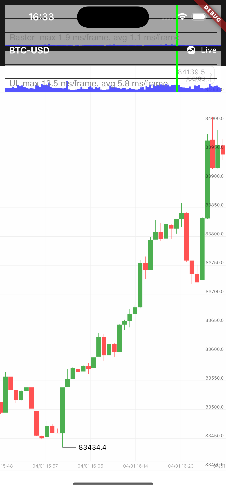
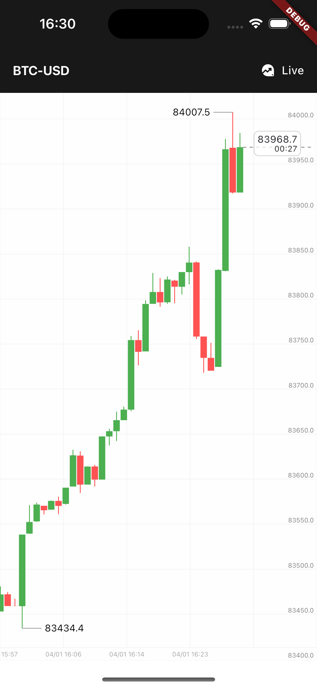
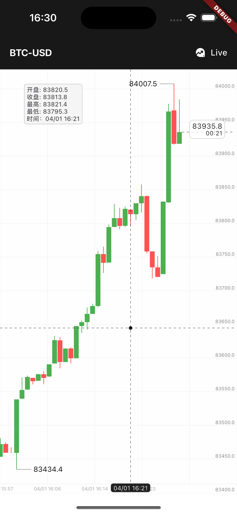
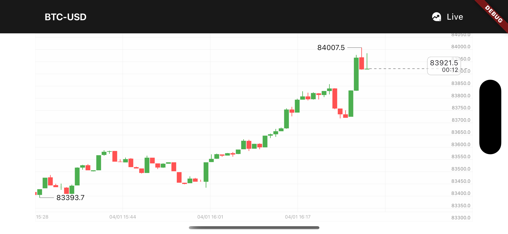

# Flutter Candlestick Chart Plugin

[中文](./README_ZH.md)

A cross-platform Flutter candlestick chart plugin, supporting iOS, Android, Web, Windows, MacOS, and Linux.
- Public data source — okx.com

## Features
- Only calculates the visible area
- Intensive calculations implemented in Rust for ultimate performance
- Customizable theme support
- Auto-snapping crosshair
- Auto-follow latest price
- Historical data loading support
- Real-time data loading support

## Extensions
The system has a powerful capability where you can:
- Input any price to get its corresponding y-coordinate in the coordinate system, or vice versa
- Input any timestamp to get the corresponding candlestick's drawing information and data

This allows you to draw any graphics you want on or behind the chart.

## Preview

<div style="display: flex; flex-wrap: wrap; gap: 10px;">
   
    
    
</div>



## Usage
```dart
        CandlestickChart(
          controller: chartController,
          onLoadHistory: getHistoryCandlesticks,
          buildLiveInfoWidget: (price, timestamp, inInScreen) => CandlestickWidgets.buildLatestPriceWidget(
            price,
            timestamp,
            inInScreen,
            () => chartController.call('followLatest'),
          ),
        )
```

> ⚠️ This project is still under development and not production-ready. Contributions are welcome! If you plan to use it in a production environment, please refer to [notes_zh.md](./notes_zh.md) for implementation details and architecture design.