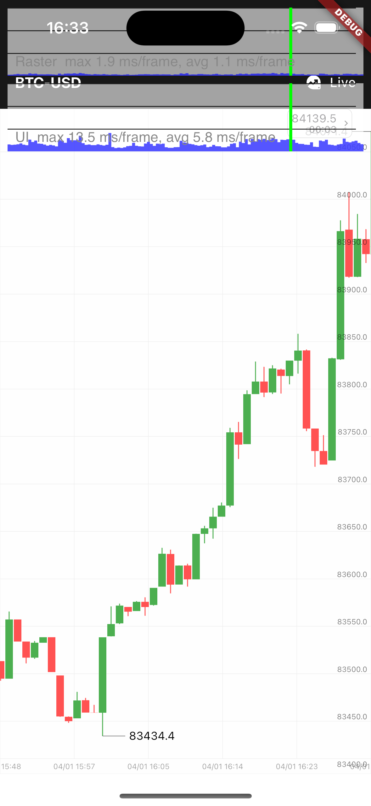
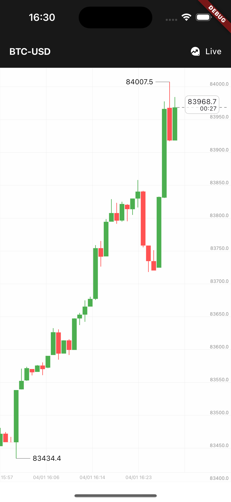
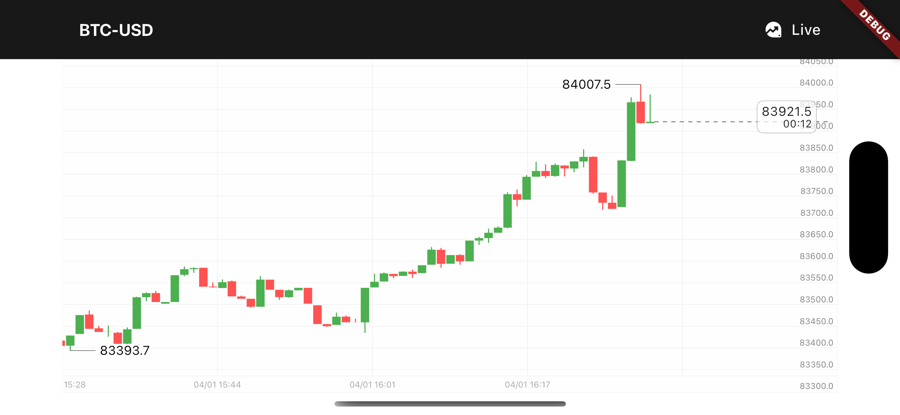

# Flutter K线图插件

> ⚠️ 该项目仍在开发中，尚未达到生产环境使用标准。欢迎参与开源贡献！如果计划将其用于生产环境，请查阅 [notes_zh.md](./notes_zh.md) 了解实现细节和架构设计。

Flutter 跨平台K线图插件，支持iOS、Android、Web、Windows、MacOS、Linux。
- 本项目公共数据来源 —— okx.com

## 特性
- 永远只计算可视区域
- 密集计算交由Rust实现，极致性能
- 支持主题配置
- 十字光标自动吸附
- 自动跟随最新价
- 支持历史数据加载
- 支持实时数据加载


##  扩展
该系统有个很强大的能力，你可以
传入任意的 price，他将返回一个基于坐标系统的y，或者相反
传入任意的 timestamp，他将返回对应的蜡烛的相关绘制信息及蜡烛信息

由此在图表上或者图表后，绘制任何你想要的图形。

## 预览

<div style="display: flex; flex-wrap: wrap; gap: 10px;">
   
    
    
</div>



## 使用
```dart
        CandlestickChart(
          controller: chartController,
          onLoadHistory: getHistoryCandlesticks,
          buildLiveInfoWidget: (price, timestamp, inInScreen) => CandlestickWidgets.buildLatestPriceWidget(
            price,
            timestamp,
            inInScreen,
            () => chartController.call('followLatest'),
          ),
        )
```